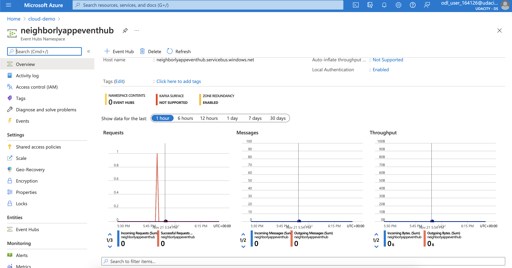
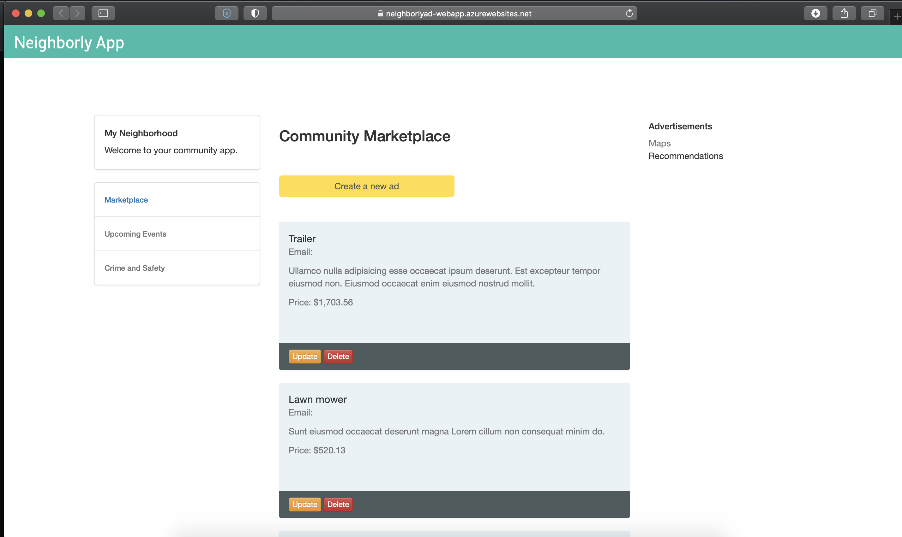

# Deploying the Neighborly App with Azure Functions

## Project Overview

For the final project, we are going to build an app called "Neighborly". Neighborly is a Python Flask-powered web application that allows neighbors to post advertisements for services and products they can offer.

The Neighborly project is comprised of a front-end application that is built with the Python Flask micro framework. The application allows the user to view, create, edit, and delete the community advertisements.

The application makes direct requests to the back-end API endpoints. These are endpoints that we will also build for the server-side of the application.

You can see an example of the deployed app below.


## Dependencies

You will need to install the following locally:

- [Pipenv](https://pypi.org/project/pipenv/)
- [Visual Studio Code](https://code.visualstudio.com/download)
- [Azure Function tools V3](https://docs.microsoft.com/en-us/azure/azure-functions/functions-run-local?tabs=windows%2Ccsharp%2Cbash#install-the-azure-functions-core-tools)
- [Azure CLI](https://docs.microsoft.com/en-us/cli/azure/install-azure-cli?view=azure-cli-latest)
- [Azure Tools for Visual Studio Code](https://marketplace.visualstudio.com/items?itemName=ms-vscode.vscode-node-azure-pack)

On Mac, you can do this with:

```bash
# install pipenv
brew install pipenv

# install azure-cli
brew update && brew install azure-cli

# install azure function core tools 
brew tap azure/functions
brew install azure-functions-core-tools@3
```

## Project Instructions

In case you need to return to the project later on, it is suggested to store any commands you use so you can re-create your work. You should also take a look at the project rubric to be aware of any places you may need to take screenshots as proof of your work (or else keep your resource up and running until you have passed, which may incur costs).

### I. Creating Azure Function App

We need to set up the Azure resource group, region, storage account, and an app name before we can publish.

1. Create a resource group.
2. Create a storage account (within the previously created resource group and region).
3. Create an Azure Function App within the resource group, region and storage account. 
   - Note that app names need to be unique across all of Azure.
   - Make sure it is a Linux app, with a Python runtime.

    Example of successful output, if creating the app `myneighborlyapiv1`:

    ```bash
    Your Linux function app 'myneighborlyapiv1', that uses a consumption plan has been successfully created but is not active until content is published using Azure Portal or the Functions Core Tools.
    ```

4. Set up a Cosmos DB Account. You will need to use the same resource group, region and storage account, but can name the Cosmos DB account as you prefer. **Note:** This step may take a little while to complete (15-20 minutes in some cases).

5. Create a MongoDB Database in CosmosDB Azure and two collections, one for `advertisements` and one for `posts`.
6. Print out your connection string or get it from the Azure Portal. Copy/paste the **primary connection** string.  You will use it later in your application.

    Example connection string output:
    ```bash
    bash-3.2$ Listing connection strings from COSMOS_ACCOUNT:
    + az cosmosdb keys list -n neighborlycosmos -g neighborlyapp --type connection-strings
    {
    "connectionStrings": [
        {
        "connectionString": "AccountEndpoint=https://neighborlycosmos.documents.azure.com:443/;AccountKey=xxxxxxxxxxxx;",
        "description": "Primary SQL Connection String"
        },
        {
        "connectionString": "AccountEndpoint=https://neighborlycosmos.documents.azure.com:443/;AccountKey=xxxxxxxxxxxxx;",
        "description": "Secondary SQL Connection String"
        } 
        
        ... [other code omitted]
    ]
    }
    ```

7. Import Sample Data Into MongoDB.
   - Download dependencies:
        ```bash
        # get the mongodb library
        brew install mongodb-community@4.2

        # check if mongoimport lib exists
        mongoimport --version
        ```

    - Import the data from the `sample_data` directory for Ads and Posts to initially fill your app.

        Example successful import:
        ```
        Importing ads data ------------------->
        2020-05-18T23:30:39.018-0400  connected to: mongodb://neighborlyapp.mongo.cosmos.azure.com:10255/
        2020-05-18T23:30:40.344-0400  5 document(s) imported successfully. 0 document(s) failed to import.
        ...
        Importing posts data ------------------->
        2020-05-18T23:30:40.933-0400  connected to: mongodb://neighborlyapp.mongo.cosmos.azure.com:10255/
        2020-05-18T23:30:42.260-0400  4 document(s) imported successfully. 0 document(s) failed to import.
        ```

8. Hook up your connection string into the NeighborlyAPI server folder. You will need to replace the *url* variable with your own connection string you copy-and-pasted in the last step, along with some additional information.
    - Tip: Check out [this post](https://docs.microsoft.com/en-us/azure/cosmos-db/connect-mongodb-account) if you need help with what information is needed.
    - Go to each of the `__init__.py` files in getPosts, getPost, getAdvertisements, getAdvertisement, deleteAdvertisement, updateAdvertisement, createAdvertisements and replace your connection string. You will also need to set the related `database` and `collection` appropriately.

    ```bash
    # inside getAdvertisements/__init__.py

    def main(req: func.HttpRequest) -> func.HttpResponse:
        logging.info('Python getAdvertisements trigger function processed a request.')

        try:
            # copy/paste your primary connection url here
            #-------------------------------------------
            url = ""
            #--------------------------------------------

            client=pymongo.MongoClient(url)

            database = None # Feed the correct key for the database name to the client
            collection = None # Feed the correct key for the collection name to the database

            ... [other code omitted]
            
    ```

    Make sure to do the same step for the other 6 HTTP Trigger functions.

9. Deploy your Azure Functions.

    1. Test it out locally first.

        ```bash
        # cd into NeighborlyAPI
        cd NeighborlyAPI

        # install dependencies
        pipenv install

        # go into the shell
        pipenv shell

        # test func locally
        func start
        ```

        You may need to change `"IsEncrypted"` to `false` in `local.settings.json` if this fails.

        At this point, Azure functions are hosted in localhost:7071.  You can use the browser or Postman to see if the GET request works.  For example, go to the browser and type in: 

        ```bash
        # example endpoint for all advertisements
        http://localhost:7071/api/getadvertisements

        #example endpoint for all posts
        http://localhost:7071/api/getposts
        ```

    2. Now you can deploy functions to Azure by publishing your function app.

        The result may give you a live url in this format, or you can check in Azure portal for these as well:

        Expected output if deployed successfully:
        ```bash
        Functions in <APP_NAME>:
            createAdvertisement - [httpTrigger]
                Invoke url: https://<APP_NAME>.azurewebsites.net/api/createadvertisement

            deleteAdvertisement - [httpTrigger]
                Invoke url: https://<APP_NAME>.azurewebsites.net/api/deleteadvertisement

            getAdvertisement - [httpTrigger]
                Invoke url: https://<APP_NAME>.azurewebsites.net/api/getadvertisement

            getAdvertisements - [httpTrigger]
                Invoke url: https://<APP_NAME>.azurewebsites.net/api/getadvertisements

            getPost - [httpTrigger]
                Invoke url: https://<APP_NAME>.azurewebsites.net/api/getpost

            getPosts - [httpTrigger]
                Invoke url: https://<APP_NAME>.azurewebsites.net/api/getposts

            updateAdvertisement - [httpTrigger]
                Invoke url: https://<APP_NAME>.azurewebsites.net/api/updateadvertisement

        ```

        **Note:** It may take a minute or two for the endpoints to get up and running if you visit the URLs.

        Save the function app url **https://<APP_NAME>.azurewebsites.net/api/** since you will need to update that in the client-side of the application.

### II. Deploying the client-side Flask web application

We are going to update the Client-side `settings.py` with published API endpoints. First navigate to the `settings.py` file in the NeighborlyFrontEnd/ directory.

Use a text editor to update the API_URL to your published url from the last step.
```bash
# Inside file settings.py

# ------- For Local Testing -------
#API_URL = "http://localhost:7071/api"

# ------- For production -------
# where APP_NAME is your Azure Function App name 
API_URL="https://<APP_NAME>.azurewebsites.net/api"
```

### III. CI/CD Deployment

1. Deploy your client app. **Note:** Use a **different** app name here to deploy the front-end, or else you will erase your API. From within the `NeighborlyFrontEnd` directory:
    - Install dependencies with `pipenv install`
    - Go into the pip env shell with `pipenv shell`
    - Deploy your application to the app service. **Note:** It may take a minute or two for the front-end to get up and running if you visit the related URL.

    Make sure to also provide any necessary information in `settings.py` to move from localhost to your deployment.

2. Create an Azure Registry and dockerize your Azure Functions. Then, push the container to the Azure Container Registry.
3. Create a Kubernetes cluster, and verify your connection to it with `kubectl get nodes`.
4. Deploy app to Kubernetes, and check your deployment with `kubectl config get-contexts`.

### IV. Event Hubs and Logic App

1. Create a Logic App that watches for an HTTP trigger. When the HTTP request is triggered, send yourself an email notification.
2. Create a namespace for event hub in the portal. You should be able to obtain the namespace URL.
3. Add the connection string of the event hub to the Azure Function.

### V.  Cleaning Up Your Services

Before completing this step, make sure to have taken all necessary screenshots for the project! Check the rubric in the classroom to confirm.

Clean up and remove all services, or else you will incur charges.

```bash
# replace with your resource group
RESOURCE_GROUP="<YOUR-RESOURCE-GROUP>"
# run this command
az group delete --name $RESOURCE_GROUP
```


## AZURE WEB DEVELOPER NEIGHBORLYAPP PROJECT DEPLOYEMNTS STEPS 

- Steps: Azure Portal and CLI:
  - Create a resource group
  - Create a storage account
  - Create an Azure Function App, using Linux and python
  - Set up a Cosmos DB Account 
  - Create a MongoDB Database in CosmosDB Azure  and two collections, one for `advertisments` and one for `posts`
  - Obtain your connection string
  - Import the sample data into MongoDB
  - Hook up all seven HTTP Triggers  to the database connection
- Deploy your Azure Functions. You should be able to reach the API endpoints from your browser.


# Create an Azure Function App with Azure CLI 
```
on MAc 

cd my_project/
source ml_env/bin/activate

cd Microsost\ Azure/Microservices\ /NeighborlyAPP_Project/

cd NeighborlyAPI/
```
- This will automatically activate the venv environment... with python version 3.9.8

`python --version `

# Note that your functionapp python version matches the local computer dev env python version. Here Python 3.7.11

`pip install -r requirements.txt`


## First login to the accaount using: 

`az login`

- sign in into Azure Tools VS Code

## Function app and storage account names must be unique
```
storageName=microadstorage
functionAppName=adlondonapp
region=uksouth 
myResourceGroup=cloud-demo
```

# Create Resource Group: this has already been created in the lab
`az group create --name $myResourceGroup --location $region`

# Create an Azure storage account in the resource group.
```
az storage account create \
  --name $storageName \
  --location $region \
  --resource-group $myResourceGroup \
  --sku Standard_LRS
```

# Create a function app in the resource group.
```
az functionapp create \
  --name $functionAppName \
  --storage-account $storageName \
  --consumption-plan-location $region \
  --resource-group $myResourceGroup \
  --functions-version  \
  --os-type Linux \
  --runtime python
```

# Alternatively on Mac
```
az functionapp create \
    --name $functionAppName\
    --storage-account $storageName \
    --resource-group $myResourceGroup \
    --os-type Linux \
    --consumption-plan-location $region \
    --runtime python
```

# Deploying with Azure CLI 
- cd Microservices/NeighborlyApp_Project/NeighborlyAPI


# NEXT: Create a Python function in Azure Using Azure CLI 

- run the command: `func init LocalAzureFuncProject --python`
- cd LocalAzureFuncProject
- run the command: ` func new --name PythonHttpNeighborApp --template "HTTP trigger" --authlevel "anonymous" `

# Run the function locally 
- on terminal, run the command: `func start`

- open the url on browser: `http://localhost:7071/api/PythonHttpNeighborApp`

- Query with by apending this to the end: `?name=Azure%20Functions`
- `http://localhost:7071/api/PythonHttpNeighborApp/?name=Azure%20Functions`

- Quit the app browser: ctrl + c

# Deploy the function project to Azure
- run the command: `func azure functionapp publish adlondonapp`

# Invoke the function
- open the Invoke url on browser: `https://adlondonapp.azurewebsites.net/api/pythonhttpneighborapp`

- append `?name=Azure%20Functions`
- `https://adlondonapp.azurewebsites.net/api/pythonhttpneighborapp/?name=Azure%20Functions`


# SET UP A COSMOS DB ACCOUNT

## Create Azure Cosmos DB Resources Using CLI: Define variables for MongoDB API resources

# Cloud Lab users should use the existing Resource group in their account
```
resourceGroupName="cloud-demo"
location='uksouth'
accountName="azurecosmosdbln" #needs to be lower case
serverVersion='4.0'
```

# Create Resource Group: This is already created for lab
- az group create -n $resourceGroupName -l $location


# Create a Cosmos account for MongoDB
```
az cosmosdb create \
  -n $accountName \
  -g $resourceGroupName \
  --locations regionName=$region \
  --kind MongoDB \
  --default-consistency-level Eventual \
  --enable-automatic-failover false
```

# Create a new MongoDB database with a sample collection 
```
DB_NAME = neighborapp-db
CREATE_LEASE_COLLECTION=0 #yes,no=(1,0)
```

# Get CosmosDB key and save it as a variable 
```
COSMOSDB_KEY=$(az cosmosdb keys list --name $accountName --resource-group $resourceGroupName --output tsv |awk '{print $1}')

az cosmosdb database create --db-name neighborapp-db \
                            --resource-group cloud-demo \
                            --key $COSMOSDB_KEY \
                            --name azurecosmosdbln \
                            --resource-group-name cloud-demo \
                            --throughput 400 \
                    

SAMPLE_COLLECTION_ADS=advertisements
SAMPLE_COLLECTION_POSTS=posts
```

# Create a MongoDB API Collection for Advertisements with a partition key and provision 400 RU/s throughput
```
az cosmosdb mongodb collection create \
    --resource-group cloud-demo \
    --name $SAMPLE_COLLECTION_ADS \
    --account-name azurecosmosdbln \
    --database-name neighborapp-db \
    --throughput 400 
```

# Create a MongoDB API Collection for Posts
```
az cosmosdb mongodb collection create \
    --resource-group cloud-demo \
    --name $SAMPLE_COLLECTION_POSTS \
    --account-name azurecosmosdbln \
    --database-name neighborapp-db \
    --throughput 400 
```

# listing connection strings from Cosmos Account
- az cosmosdb keys list -n azurecosmosdbln -g cloud-demo --type connection-strings

- copied connection strings
```
{
  "connectionStrings": [
    {
      "connectionString": "mongodb://azurecosmosdbln:HEbTAVWb6jit5uNbhFRY9hunPfqWpt2Pu35K2PWFyuhfLYgXmsz1Nd7Dv7pALt7cvytXCjkCvIxiW32Cb5iJ3A==@azurecosmosdbln.mongo.cosmos.azure.com:10255/?ssl=true&replicaSet=globaldb&retrywrites=false&maxIdleTimeMS=120000&appName=@azurecosmosdbln@",
      "description": "Primary MongoDB Connection String"
    },
    {
      "connectionString": "mongodb://azurecosmosdbln:EOyVHfCQloPDHYZmgrHrHZV09Ve9FTD2OBhxVOVvG5aoShuJdUbQ5fBn8BM1tlFgMCVvfQ0b8dxlx3iiDMGJgw==@azurecosmosdbln.mongo.cosmos.azure.com:10255/?ssl=true&replicaSet=globaldb&retrywrites=false&maxIdleTimeMS=120000&appName=@azurecosmosdbln@",
      "description": "Secondary MongoDB Connection String"
    },
    {
      "connectionString": "mongodb://azurecosmosdbln:dgtYfkIalcA2l3asDo13o3s1MCx9PfPk4q8gigkIiOzfaKvw7BeTPoKtoAjcxh17KrCNioNIn76UacIrEZO4kw==@azurecosmosdbln.mongo.cosmos.azure.com:10255/?ssl=true&replicaSet=globaldb&retrywrites=false&maxIdleTimeMS=120000&appName=@azurecosmosdbln@",
      "description": "Primary Read-Only MongoDB Connection String"
    },
    {
      "connectionString": "mongodb://azurecosmosdbln:Rr2fq62WSxa5BpnpZzSFLP9Gk3Sdu3vIMLTZbnj5XVGrBrqvEw0ezo0EiegYubq7gT3u6TvzeCgJUQ3qqBWbQQ==@azurecosmosdbln.mongo.cosmos.azure.com:10255/?ssl=true&replicaSet=globaldb&retrywrites=false&maxIdleTimeMS=120000&appName=@azurecosmosdbln@",
      "description": "Secondary Read-Only MongoDB Connection String"
    }
  ]
}
```

# Import the data from the sample_data directory for Ads and posts to fill the app

# get the mongodb library
- brew install mongodb-community@4.2

# check if mongoimport lib exists
- mongoimport --version


# This information is viewable in your portal >> Azure Cosmos DB >> Select the DB name >> Settings >> Connection String >>
# replace the host, port, username, and primary password with your own
```
MONGODB_HOST=azurecosmosdbln.mongo.cosmos.azure.com
MONGODB_PORT=10255
USER=azurecosmosdbln
```
# Copy/past the primary password here
```
PRIMARY_PW=HEbTAVWb6jit5uNbhFRY9hunPfqWpt2Pu35K2PWFyuhfLYgXmsz1Nd7Dv7pALt7cvytXCjkCvIxiW32Cb5iJ3A==

FILE_DIR_ADS=../sample_data/sampleAds.json
FILE_DIR_POSTS=../sample_data/samplePosts.json
```
#Import command for Linux and Mac OS
```
mongoimport -h $MONGODB_HOST:$MONGODB_PORT \
--db neighborapp-db --collection $SAMPLE_COLLECTION_ADS -u $USER -p $PRIMARY_PW \
--ssl  --jsonArray  --file $FILE_DIR_ADS --writeConcern "{w:0}"

mongoimport -h $MONGODB_HOST:$MONGODB_PORT \
--db neighborapp-db --collection $SAMPLE_COLLECTION_POSTS -u $USER -p $PRIMARY_PW \
--ssl  --jsonArray  --file $FILE_DIR_ADS --writeConcern "{w:0}"
```

## Create Event Hub and Logic App | Create EventHub on Azure portal
```
storageName=microadstorage
functionAppName=adlondonapp
region=uksouth 
myResourceGroup=cloud-demo
Type=Consumption
LogicAppName=AdLogicApp
Namespace name=neighborlyappeventhub
Throughput Units=40
Pricing tier=Basic
```

- select `neighborlyappeventhub` >> Shared access Policy 
```
Connection-string-primary-key=Endpoint=sb://neighborlyappeventhub.servicebus.windows.net/;SharedAccessKeyName=RootManageSharedAccessKey;SharedAccessKey=lss2c/lwDZQQ5Pj7wzfKm6WEk4enjUGPn+F782qx2mA=
```

# Synching local.setting.json in VS and Azure 
```
softwareupdate --all --install --force

brew tap azure/functions
brew install azure-functions-core-tools@4

storageName=microadstorage
functionAppName=adlondonapp
region=uksouth 
myResourceGroup=cloud-demo

func azure functionapp publish $functionAppName --python


func azure functionapp fetch-app-settings $functionAppName  # to copy from Azure to local
func azure functionapp publish $functionAppName  --publish-settings-only # to copy from local to Azure
```

# Create Logic App And Send Email 
```
RESOURCE_GROUP=cloud-demo
Logic_App_name=adlogicApp
region=uksouth
Type=Consumption
```

# Part2 - Deploy your client app from the NeighborlyFrontEnd 
- cd NeighborlyFrontEnd 

- pip install -r requiremnets.txt

# Inside file settings.py

# ------- For Local Testing -------
#API_URL = "http://localhost:7071/api"

# ------- For production -------
# where APP_NAME is your Azure Function App name 
- API_URL="https://adlondonapp.azurewebsites.net/api"


- Make sure Werkzeug<1.0 because werkzeug.contrib.atom is deprecated in recent versions of Werkzeug

- Also the code does not use dominate, visitor, azure-functions, flask-restplus and flask_swagger_ui for anything. You can remove them.

- You can deploy the client-side Flask app with:
```

APP_NAME=neighborlyad-webapp
myResourceGroup=cloud-demo
region=uksouth


az webapp up \
 --resource-group cloud-demo \
 --name $APP_NAME \
 --sku F1 \
 --location $region \
 --verbose
```

- After running this command once, a configuration file will be created that will store any arguments you gave the previous time, so you can run just az webapp up and it will re-use arguments. Note that certain updates, such as changes to requirements.txt files, won't be appropriately pushed just by using az webapp up, so you may need to use az webapp update or just delete the app and re-deploy.
```
az webapp up \
 --name $APP_NAME \
 --verbose 
```
- Once deployed, the flask app will be available at the URL http://<APP_NAME>.azurewebsites.net/ - meaning the app name you use must be unique.


# Part 3: CI/CD Deployment

    1. Create an Azure Registry
    2. Dockerize your Azure Functions

# create docker file 
- func init --docker-only --python

# Create Registry on Azure portal but here using CLI to create Azure registry container
```
RESOURCE_GROUP="cloud-demo"
APP_REGISTRY="neighborlyAppRegistry"

az acr create --resource-group $RESOURCE_GROUP --name $APP_REGISTRY --sku Basic
```

- In the Azure portal, search Container Registries. Here, you should be able to see the registry that you created in Step 2. Navigate to the registry amd click on Access Keys. By default, the Admin user option would be disabled. Enable it.
```
REGISTRY_SERVER=neighborlyappregistry.azurecr.io
REGISTRY=neighborlyAppRegistry


docker login neighborlyappregistry.azurecr.io --username neighborlyAppRegistry --password YK1pWFYa=zvS3gLp=/s=3di7b6kqDybk


image_name=neighborly-api

TAG=neighborlyappregistry.azurecr.io/neighborlyapp-api:v1
docker build -t $TAG .

# List your images with:
docker images
```


- push the container to the Azure Container Registry
```
REGISTRY_SERVER=neighborlyappregistry.azurecr.io

az acr login --name $REGISTRY_SERVER
docker push neighborlyappregistry.azurecr.io/neighborlyapp-api:v1
```

# Part 3: Create a Kubernetes Cluster
- Create a Kubernetes cluster, and verify your connection to it with `kubectl get nodes`

- Run the installation command: `brew install kubectl` or `brew install kubernetes-cli`
- Test to ensure the version you installed is up-to-date: `kubectl version --client`
```

RESOURCE_GROUP=cloud-demo
AKS_CLUSTER=neighborlyapp-aks-cluster

az aks create --resource-group $RESOURCE_GROUP --name $AKS_CLUSTER --node-count 2 --enable-addons monitoring --generate-ssh-keys

# Merge "neighborly-aks-cluster" as current context in /Users/<username>/.kube/config
az aks get-credentials --name $AKS_CLUSTER --resource-group $RESOURCE_GROUP

#verify your connection to it with:
kubectl get nodes
```

# Deploy app to Kubernetes, and check your deployment with kubectl config get-contexts:
-To run Functions on your Kubernetes cluster, you must install the KEDA component. You can install this component using Azure Functions Core Tools.
```
func kubernetes install --namespace keda

RESOURCE_GROUP=cloud-demo
AKS_CLUSTER=neighborlyapp-aks-cluster
IMAGE_NAME=neighborlyappregistry.azurecr.io/neighborlyapp-api:v1
REGISTRY=neighborlyAppRegistry
```

# Update a managed Kubernetes cluster. Where --attach-acr grants the 'acrpull' role assignment to the ACR specified by name or resource ID. It might take up to 10 minutes or more for it to work. be patient.

```
az aks update -n $AKS_CLUSTER -g $RESOURCE_GROUP --attach-acr $REGISTRY 

func kubernetes deploy --name $AKS_CLUSTER \
--image-name $IMAGE_NAME \
-—polling-interval 3 —cooldown-period 5

# Check your deployment:

kubectl config get-contexts
```


# Deployment Images for step guide


- Deployed Resources 


- Event Trigger Endpoint Configuration 


- Event Triggers


- MongoDB Database and Collections


- Function App HTTP Triggers


- Syncing Triggers


- Connection string endpoint


- Logic App Design Triger


- Logic App Design Triger2


- Logic App Email Triger


- Web Deployment


- Web Deployment App


- Web Deployment App2


# Resources 
- You will need to install the following locally:
  - [Azure core functions cmd](https://github.com/Azure/azure-functions-core-tools)
  - [Pipenv](https://pypi.org/project/pipenv/)
  - [VS Code](https://code.visualstudio.com/download)
  - [Azure Function tools V3](https://docs.microsoft.com/en-gb/azure/azure-functions/functions-run-local?tabs=windows%2Ccsharp%2Cportal%2Cbash%2Ckeda#install-the-azure-functions-core-tools&WT.mc_id=udacity_learn-wwl)
  - [Install Azure CLI](https://docs.microsoft.com/en-us/cli/azure/install-azure-cli)
  - [Microservices project](https://github.com/udacity/nd081-c2-Building-and-deploying-cloud-native-applications-from-scratch-project-starter)
  - [Azure Tools for Visual Studio Code](https://marketplace.visualstudio.com/items?itemName=ms-vscode.vscode-node-azure-pack)
  - [Connecting a MongoDB appliaction to Azure Cosmos](https://docs.microsoft.com/en-gb/azure/cosmos-db/mongodb/connect-mongodb-account?WT.mc_id=udacity_learn-wwl)
  - [Udacity Microsoft Azure Web Developer Resource](https://github.com/DhruvKinger/Link-of-all-blogs)
  - [Udacity Microsoft Web Developer Projects Resources](https://github.com/DhruvKinger/Udacity-KnowledgeQuestions/)
  - [Download MongoDB Compass](https://www.mongodb.com/try/download/compass)
- [Find all Azure command arguements here](https://docs.microsoft.com/en-gb/cli/azure/webapp?view=azure-cli-latest#az-webapp-up&?WT.mc_id=udacity_learn-wwl)
- [ Docker installations for all OS](https://docs.docker.com/get-docker/)
- [Dockerfile](https://docs.docker.com/engine/reference/builder/)
- [Private Docker container registeries](https://docs.microsoft.com/en-gb/azure/container-registry/container-registry-intro?WT.mc_id=udacity_learn-wwl)
- [Azure container Registry documentation](https://docs.microsoft.com/en-gb/azure/container-registry/container-registry-concepts?WT.mc_id=udacity_learn-wwl)

